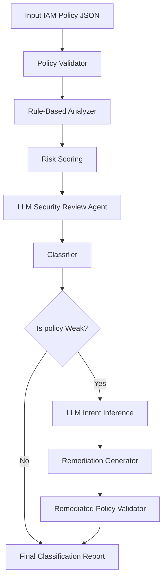

# AWS IAM Policy Classification Engine

## Overview

This project implements an agentic AWS IAM policy classification engine.

The system receives an AWS IAM policy JSON, classifies it as `Weak` or `Strong`, and if the policy is weak, generates a remediated version with explanations.

The system follows a hybrid architecture combining:

- Rule-based IAM security analyzer
- LLM reasoning agent
- LLM-based intent inference for remediation
- Policy validator
- Evaluation runner

---

## Classification Definition

The classifier follows the principle of least privilege.

A policy is considered `Weak` when it grants excessive, destructive, or hard-to-reason-about permissions.

A policy is considered `Strong` when it grants scoped, explicit, and least-privilege permissions.

### Risk Scoring

| Severity | Score |
|---|---:|
| Critical | 5 |
| High | 3–4 |
| Medium | 2 |
| Low | 1 |

### Classification Threshold

```
risk_score >= 4 => Weak
risk_score < 4  => Strong
```

### Weak Policy Indicators

Examples of weak indicators:

- `Action: "*"`
- `Resource: "*"`
- Service-level wildcards such as `ec2:*`, `iam:*`, `s3:*`
- Privilege escalation actions such as `iam:PassRole`, `sts:AssumeRole`
- Destructive actions such as `Delete*` or `Terminate*`
- `Allow` combined with `NotAction`
- Wildcard resource ARNs
- Missing `Condition`

---

## Architecture



---

## Components

### Policy Validator

Validates the IAM policy structure.

**Input:**
- IAM policy JSON

**Output:**
- Validation result (valid / invalid)
- Validation errors

---

### Rule-Based Analyzer

Detects known IAM security risks using deterministic rules.

**Input:**
- Validated IAM policy

**Output:**
- Findings
- Severity
- Risk score contribution
- Evidence

---

### LLM Security Review Agent

Simulates a senior cloud security engineer reviewing the policy.

**Input:**
- IAM policy
- Rule-based findings
- Initial classification

**Output:**
- LLM classification
- Security reasoning
- Confidence

If the LLM is unavailable, rate-limited, or not configured, the system falls back to deterministic rule-based classification.

---

### LLM Intent Inference

Attempts to infer the original intent of overly permissive policies.

**Input:**
- Weak IAM policy
- Findings

**Output:**
- Inferred intent
- Target service
- Suggested least-privilege actions
- Scoped resource hint
- Confidence level

---

### Remediation Generator

Generates a safer IAM policy while preserving intent when possible.

**Input:**
- Weak IAM policy
- Findings
- Inferred intent

**Output:**
- Remediated policy
- Explanation of changes

---

### Evaluation Runner

Runs the system on a labeled dataset and measures performance.

**Output:**
- Agreement rate
- Execution time
- Per-policy results

---

## How to Run

Install dependencies:

```bash
pip install -r requirements.txt
```

Run a single policy:

```bash
python -m src.main examples/weak_admin.json
```

Run evaluation:

```bash
python -m src.evaluate
```

---

## LLM Configuration

Create a `.env` file:

```env
OPENAI_API_KEY=your_api_key_here
```

If the key is missing or the API fails (e.g., quota exceeded), the system continues in rule-based fallback mode.

---

## Evaluation Results

Evaluation was performed on a labeled dataset of 12 IAM policies.

```
Total policies: 12
Correct classifications: 12
Agreement rate: 100%
```

The dataset includes diverse AWS services:

- S3
- IAM
- EC2
- KMS
- Lambda
- DynamoDB
- CloudWatch

---

## Example Output

```json
{
  "classification": "Weak",
  "risk_score": 14,
  "findings": [
    {
      "severity": "critical",
      "score": 5,
      "issue": "Wildcard action",
      "evidence": "Statement 0 uses Action: *"
    }
  ],
  "reason": "The policy is weak because it contains risky IAM patterns.",
  "llm_review": {
    "used_llm": false,
    "summary": "LLM review failed or was skipped.",
    "confidence": "low"
  },
  "remediation": {
    "intent_inference": {
      "intent": "unknown",
      "confidence": "low"
    },
    "remediated_policy": {},
    "changes": []
  }
}
```

---

## Limitations

Some IAM policies are too broad to infer their original intent.

For example:

```json
{
  "Action": "*",
  "Resource": "*"
}
```

This policy does not provide enough context to determine whether the intended use case involves S3, EC2, DynamoDB, or administrative access.

This limitation is inherent to IAM policies that lack contextual constraints.

In such cases, the system applies a conservative fallback remediation strategy.

---

## Future Improvements

- More advanced LLM-based intent inference
- Interactive clarification for ambiguous policies
- Deeper IAM grammar validation
- Integration with AWS Access Analyzer
- Larger evaluation dataset
- Service-specific remediation templates

---

## Definition of Done

The system is considered successful if:

- IAM policy structure is validated
- High-risk IAM patterns are detected
- Policies are classified as Weak or Strong
- Findings are explained clearly
- Weak policies are remediated
- Remediated policies are validated
- Evaluation dataset is processed
- Agreement rate and runtime are reported