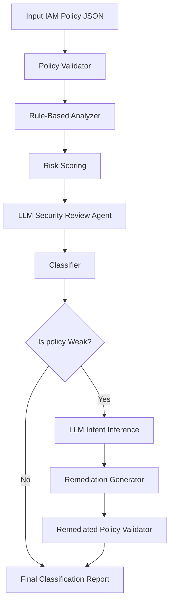

# AWS IAM Policy Classification Engine

## Overview

This project implements an agentic AWS IAM policy classification engine.

The system receives an AWS IAM policy JSON, classifies it as `Weak` or `Strong`, and if the policy is weak, generates a remediated version with explanations.

The system follows a hybrid architecture combining:

- Rule-based IAM security analyzer
- LLM reasoning agent
- LLM-based intent inference for remediation
- Policy validator
- Evaluation runner

---

## Classification Definition

The classifier follows the principle of least privilege.

A policy is considered `Weak` when it grants excessive, destructive, or hard-to-reason-about permissions.

A policy is considered `Strong` when it grants scoped, explicit, and least-privilege permissions.

### Risk Scoring

| Severity | Score |
|---|---:|
| Critical | 5 |
| High | 3–4 |
| Medium | 2 |
| Low | 1 |

### Classification Threshold

```
risk_score >= 4 => Weak
risk_score < 4  => Strong
```

### Weak Policy Indicators

Examples of weak indicators:

- `Action: "*"`
- `Resource: "*"`
- Service-level wildcards such as `ec2:*`, `iam:*`, `s3:*`
- Privilege escalation actions such as `iam:PassRole`, `sts:AssumeRole`
- Destructive actions such as `Delete*` or `Terminate*`
- `Allow` combined with `NotAction`
- Wildcard resource ARNs
- Missing `Condition`

---

## Architecture



---

## Components

| Component | Type | Input | Output | Purpose |
|---|---|---|---|---|
| Policy Validator | Tool | IAM policy JSON | valid/errors | Ensures policy structure is correct |
| Rule-Based Analyzer | Tool | Valid policy | findings + scores | Detects deterministic IAM risks |
| LLM Security Review | Agent | policy + findings | reasoning | Adds contextual security reasoning |
| Intent Inference | Sub-agent | weak policy | inferred intent | Helps remediation preserve intent |
| Remediator | Tool | policy + findings + intent | fixed policy | Generates safer policy |
| Evaluation Runner | Tool | dataset | metrics | Measures performance |

---

## Design Justification

The system uses a hybrid architecture because IAM policy analysis requires both deterministic checks and contextual reasoning.

Rule-based analysis was implemented as a separate tool because known IAM risks (such as wildcard permissions, privilege escalation, and destructive actions) are deterministic and should always be detected reliably.

The LLM is used as a reasoning agent rather than the main classifier because LLM-only systems can produce inconsistent or hallucinated outputs. The LLM is therefore limited to explanation and intent inference.

The system is designed to be fault-tolerant and continues to operate correctly even when the LLM is unavailable.

The validator is separated from the analyzer to isolate syntax validation from security analysis.

The remediation component is separated because fixing a policy requires different logic from detecting issues.

---

## Alternatives Considered

### LLM-only classifier

Rejected because it may produce inconsistent classifications and may miss deterministic IAM risks.

### Rule-only classifier

Rejected because it cannot reason about intent and provides limited explanations.

### AWS Access Analyzer

Not used as the primary solution because the task requires building an agentic system, but it is a strong candidate for future integration.

---

## How to Run

Install dependencies:

```bash
pip install -r requirements.txt
```

Run a single policy:

```bash
python -m src.main examples/weak_admin.json
```

Run evaluation:

```bash
python -m src.evaluate
```

---

## LLM Configuration

Create a `.env` file:

```env
OPENAI_API_KEY=your_api_key_here
```

If the key is missing or the API fails (e.g., quota exceeded), the system continues in rule-based fallback mode.

---

## Evaluation Report

The system was evaluated on a labeled dataset of IAM policies.

### Metrics

- Classification agreement rate
- Execution time
- Remediation validity

### Definition of Done

- Agreement rate ≥ 80%
- All remediated policies must be valid
- Every policy must return explained findings

### Results

```
Total policies: 12
Correct classifications: 12
Agreement rate: 100%
```

The dataset includes diverse AWS services:

- S3
- IAM
- EC2
- KMS
- Lambda
- DynamoDB
- CloudWatch

---

## Example Output

```json
{
  "classification": "Weak",
  "risk_score": 14,
  "findings": [
    {
      "severity": "critical",
      "score": 5,
      "issue": "Wildcard action",
      "evidence": "Statement 0 uses Action: *"
    }
  ],
  "reason": "The policy is weak because it contains risky IAM patterns.",
  "llm_review": {
    "used_llm": false,
    "summary": "LLM review failed or was skipped.",
    "confidence": "low"
  },
  "remediation": {
    "intent_inference": {
      "intent": "unknown",
      "confidence": "low"
    },
    "remediated_policy": {},
    "changes": []
  }
}
```

---

## Limitations

Some IAM policies are too broad to infer their original intent.

For example:

```json
{
  "Action": "*",
  "Resource": "*"
}
```

This policy does not provide enough context to determine the intended use case.

This limitation is inherent to IAM policies that lack contextual constraints.

In such cases, the system applies a conservative fallback remediation strategy.

---

## Future Improvements

- Stronger LLM-based intent inference
- Interactive clarification for ambiguous policies
- Deeper IAM grammar validation
- Integration with AWS Access Analyzer
- Larger evaluation dataset
- Service-specific remediation templates

---

## Definition of Done

The system is considered successful if:

- IAM policy structure is validated
- High-risk IAM patterns are detected
- Policies are classified as Weak or Strong
- Findings are explained clearly
- Weak policies are remediated
- Remediated policies are validated
- Evaluation dataset is processed
- Agreement rate and runtime are reported